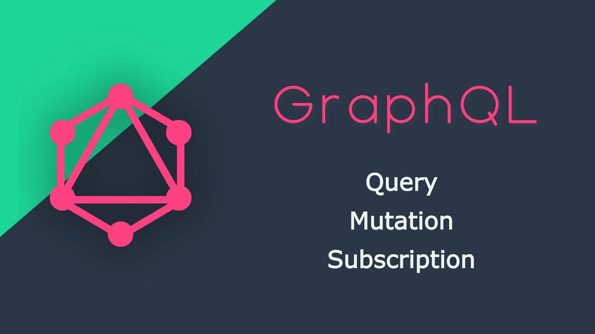

<!-- PROJECT LOGO -->
<br />
<p align="center">
    
</p>

# Backend Project

<details open="open">
  <summary>Table of Contents</summary>
  <ol>
    <li>
      <a href="#about-the-project">About The Project</a>
      <ul>
        <li><a href="#built-with">Built With</a></li>
      </ul>
    </li>
    <li>
      <a href="#getting-started">Getting Started</a>
      <ul>
        <li><a href="#prerequisites">Prerequisites</a></li>
        <li><a href="#installation">Installation</a></li>
      </ul>
    </li>
    <li>
      <a href="#usage">Usage</a>
      <ul>
        <li><a href="#directory-structure">Directory structure</a></li>
      </ul>
    </li>
    <li>
      <a href="#configure-ngrock">Configure Ngrock</a>
    </li>
    <li>
      <a href="#locust-deploy">Locust Deploy</a>
    </li>
    <li>
      <a href="#documentation">Documentation</a>
      <ul>
        <li><a href="#swagger">Swagger</a></li>
      </ul>
    </li>
    <li><a href="#teams-standards">Team's Standards</a></li>
    <li><a href="#contact">Contact</a></li>
  </ol>
</details>

## About The Project

### GraphQL API Challenge

The primary goal of this challenge is to provide a body of work that facilitates a discussion about how you approach problem-solving and coding. This challenge is designed to take only a few hours and will be followed by a panel discussion. During the discussion, you will share your screen to walk through your code, explain your decisions, and potentially make changes or add features on the fly.

### Challenge Scope

This task assesses your ability to analyze data, design a schema, and construct an efficient, scalable way to interact with the data.

### Technical Specifications

#### Schema Design

- Analyze the structure of the provided `materials.csv` file to design a schema that supports efficient querying and extensibility.
- The schema should align with potential query patterns and ensure optimized database performance.

#### Database Setup

- Select a relational database system of your choice (e.g., SQLite, PostgreSQL, MySQL). You can run the database locally or in the cloud.
- Load the data from `materials.csv` into the database, ensuring proper table creation and data integrity.

#### GraphQL API Development

- Employ a GraphQL library such as Apollo Server or express-graphql to facilitate API construction.
- Construct GraphQL API endpoints that expose the data from `materials.csv` and support specific queries and mutations.

#### Execution and Interaction

- Ensure the API allows seamless interaction for sending and receiving data.
- Be prepared to interactively demonstrate and adapt your implementation during the panel discussion, explaining your design choices and addressing any real-time changes or additions.

### Queries

Your API should be able to produce:

- A query to retrieve all records from the database, ensuring optimized performance.
- A list of parts by manufacturer name (with wildcard search support).
- Item count and average, minimum, and maximum price for a category.

### Submission Deliverables

A fully functional Node.js application incorporating the following capabilities:

- A GraphQL API that enables querying and mutating the ingested data from `materials.csv`.
- Documentation detailing the setup and execution of the application, including all necessary dependencies, configuration steps, and runtime requirements.
- Example GraphQL queries and mutations demonstrating the functionality of the API, accompanied by expected outputs.
- A Git repository containing all of your work.

### Evaluation Criteria

- **Design Quality**: Structure of the project, alignment with requirements, and extensibility.
- **Code Quality**: Adherence to best practices for readability, maintainability, and modularity.
- **Functional Compliance**: Alignment with the outlined requirements and constraints.
- **Error Management**: Robust handling of edge cases and invalid inputs.
- **GraphQL Utilization**: Efficient and structured implementation of queries and mutations.

### Additional Notes

- The `materials.csv` file will be provided and is integral to this challenge. The solution should be tailored to accommodate its structure and content.
- The challenge is designed to assess your ability to work independently with Node.js, GraphQL, and relational databases.
- The follow-up panel discussion will focus on your approach, design choices, and ability to adapt your solution in real-time.

### Built With

- [NodeJS](https://nodejs.org/es/)
- [Express](https://expressjs.com/)
- [TypeORM](https://typeorm.io/)
- [PostgreSQL](https://www.postgresql.org/)
- [Apollo Server](https://www.apollographql.com/)
- [GraphQL](https://graphql.org/)

## Getting Started

### Prerequisites

In order to run the application you must have the following tools installed:

- **Node 20.18.1 LTS**, in case you don't have it you can follow the instructions to install it with [NVM](https://github.com/nvm-sh/nvm)

### Installation

1. Clone the repo

   ```sh
    git clone https://github.com/juliocm18/graphql-materials-exam.git
   ```

2. Locate in the project folder

   ```sh
    cd graphql-materials-exam/
   ```

3. copy the example.env file to a new file called .env and update the env variable values.

4. Install project dependencies

   ```sh
    npm install
   ```

5. Start the api in development mode
   ```sh
    npm run dev
   ```

## Usage

### Directory structure

Inside of the application you will find a src folder with the following structure:

    src
    ├── bootstrap
    ├── core
    │   ├── config
    │   ├── bootstrap
    │   ├── exceptions
    │   ├── infraestructure
    │   │   ├── typeorm
    ├── modules
    │   ├── {ModuleName}
    │   │   ├── application
    │   │   ├── infraestructure
    │   │   │   ├── entities
    │   │   │   ├── resolvers
    ├── index.ts

### Configure Ngrock

- To use ngrok with your API in the Windows console, follow these steps:

- Download ngrok: Go to the official ngrok website (https://ngrok.com/) and download the corresponding Windows version.

- Unzip the file: Extract the downloaded ZIP file to a convenient location on your hard drive.

- Open the command window: Open the Windows command window. You can do this by pressing the Windows key + R, typing "cmd" and then pressing Enter.

- Configure your session

```sh
ngrok config add-authtoken {token}
```

- To start a HTTP tunnel forwarding to your local port {xxx}, run this next:

```sh
ngrok http 4000
```

## Team's standards

- [Standards & Best Practices](#)
- [Branching strategy](#)
- [PR Template](./pull-request.md)

## Contact

Author: **Julio Becerra** Dev
